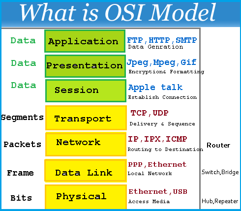

# ALX SE Project - 0x07-networking_basics

Answer questions based on the OSI Model

## New Commands

``ping`` -- sends an ICMP request to a server ``netstat`` -- Displays a list of servers a machine is connected to 

## Description of Files

<h6>0-OSI_model</h6>

Answers for the OSI Model

<h6>1-types_of_network</h6>
Answers for task 1

<h6>2-MAC_and_IP_address</h6>
Answers for task 2

<h6>3-UPD_and_TCP</h6>
Answers for task 3

<h6>4-TCP_and_UDP_ports</h6>
Answers for task 4

<h6>5-is_the_host_on_the_network</h6>
Answers for task 5

